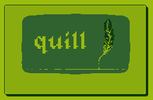
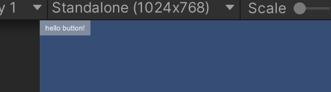
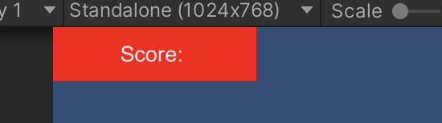

<p align="center">
  
</p>

## quill

Quill is just a small wrapper based on pure UnityUI. You can create UI by using its c# api, programmatically.

Quill also comes with lua api support(experimental). That means you can run lua code from `StreamingAssets` and make ui in unity. 

[Documentation](https://github.com/cemuka/Quill/wiki)

### Components

#### Label
```cs
var label = Quill.CreateLabel("hello world");
label.SetSize(100, 30);
label.SetPosition(100, 100);
```

#### Button
```cs
var button = Quill.CreateButton("hello button!");
button.onClick.AddListener(SomeMethod);
button.interactable = false;
```



#### Box
```csharp
var panelParent = Quill.CreateEmpty();
panelParent.SetSize(300, 80);

var box = Quill.CreateBox(Color.red);
var label = Quill.CreateLabel("Score: ");
label.alignment = TextAnchor.MiddleCenter;
label.fontSize = 32;

panelParent.root.Add(box);
panelParent.root.Add(label);

label.StretchToParentContainer();
box.StretchToParentContainer();
```



## quill lua api

To enable lua feature, initialize and update the api like below.
Quill will look into `StreamingAssets/LUA` directory for `main.lua` file.

```cs
private void Start()
{
    Quill.Init();
    QuillLua.Run(); 
}

private void Update()
{
    QuillLua.Update();
}

private void OnDestroy()
{
    QuillLua.Exit();
}
```
Here is the structure of the `StreamingAssets/LUA/main.lua`
```lua
function OnInit()

end

function OnUpdate(dt)

end

function OnExit()

end
```

## Lua example

```lua

local timePassed = 0
local timeLabel = nil

function OnInit()

    local root = quill.empty()

    color = {}
    color.r = 0.4
    color.g = 0.8
    color.b = 0.3

    local box = quill.box()
    box:setColor(color.r, color.g, color.b)
    box:setSize(300, 100)
    root:addChild(box)

    timeLabel = quill.label("time")
    timeLabel:setSize(300, 100)
    
    root:addChild(timeLabel)
end

function OnUpdate(dt)
    timePassed = timePassed + dt
    timeLabel:setText("time: " .. string.format("%.2f", timePassed))

end
```


## This project is heavily WIP.


## For more detail
Here is the first devlog: [introduction to quill](https://dev.to/cemuka/introduction-to-quill-a-minimal-unity-ui-framework-with-lua-modding-support-devlog0-pm7)

## references
[Moonsharp](https://www.moonsharp.org)