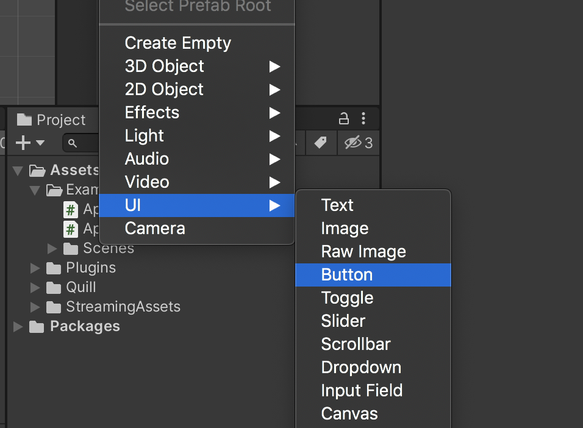
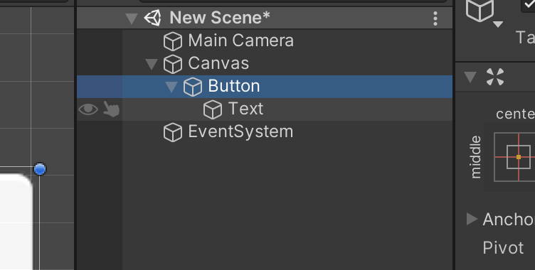
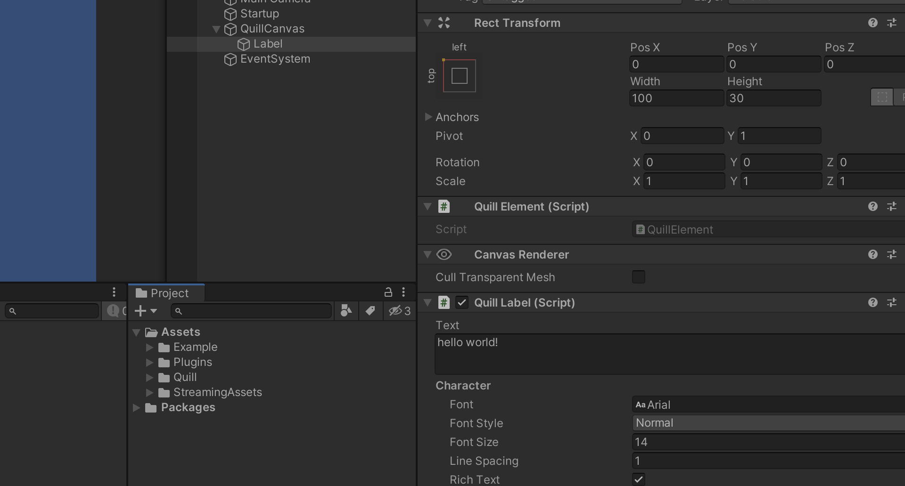
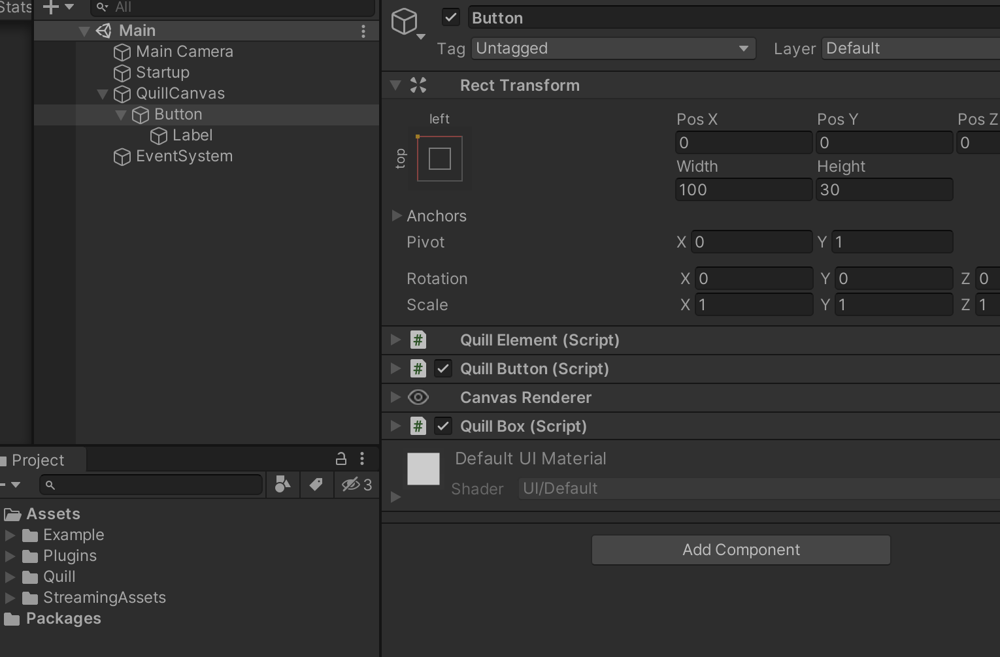

<p align="center">
  
</p>

## quill

Quill is just a small wrapper based on pure UnityUI. You can create UI by using its c# api, programmatically.

### Components

`Label`
```cs
var label = Quill.CreateLabel("hello world");
label.SetSize(100, 30);
label.SetPosition(100, 100);
```

`Button`
```cs
var button = Quill.CreateButton("hello button!");
button.onClick.AddListener(SomeMethod);
button.interactable = false;
```


`Box`
```csharp
var panelParent = Quill.CreateEmpty();
panelParent.SetSize(300, 80);

var box = Quill.CreateBox(Color.red);
var label = Quill.CreateLabel("Score: ");
label.alignment = TextAnchor.MiddleCenter;
label.fontSize = 32;

panelParent.root.Add(box);
panelParent.root.Add(label);

label.StretchToParentContainer();
box.StretchToParentContainer();
```


## Motivation

Unity Editor allows us to design and create ui objects in any `Scene`. These objects need to be placed in a `Canvas` component and premade ui elements like `Button` and `Text` can be created in the active scene. Any `MonoBehaviour` object that lives in the scene can be saved as a `Prefab` . That allows us to use them in multiple scenes, instantiate in runtime or achieve [nested prefabs and variants]([https://docs.unity3d.com/Manual/NestedPrefabs.html](https://docs.unity3d.com/Manual/NestedPrefabs.html)) introduced in  2018.3 version.



This workflow is visually easy to prototype and design. Especially static elements in the scene like a background or a label that sits in the scene. But the dynamic control or runtime manipulation of scene elements via code can be overwhelming. Each element needs to be referenced before the application started from the scene or in the runtime, searching through the scene or any `MonoBehaviour` via `GetComponent<T>` methods. 

```cs
public class SomeManager : MonoBehaviour
{
    //  If your class attached to an object before game started
    //  your components can be referenced like this from the editor
    public Button buttonFromScene;

    private void Start()
    {
        //  Find the object int the scene matching exact name
        //  Get the component via api
        Text scoreLabel = GameObject.Find("Score Label").GetComponent<Text>();
    }
}
```

This methodology leads us to create wrapper objects to hold these multiple references to

```cs
// It is possible to create a prefab that hold the referances
public class SomeView : MonoBehaviour
{
    public Button buttonFromPrefab;
    public Text buttonLabel;
    public Dropdown optionsDropdown;
}

public class SomeManager : MonoBehaviour
{
    ...
    private void CreateUI()
    {
        //  prefab gameObject could be loaded from Resources
        GameObject uiObject = Instantiate(uiPrefab, uiParent);
        SomeView ui = uiObject.GetComponent<SomeView>();
        
        ui.buttonLabel.text = "some label";
        ui.buttonFromPrefab.onClick.AddListener(SomeMethod);
    }

    private void SomeMethod()
    {
        //  Do stuff
    }
    ...
}
```

This example is the way I do most of the time when things get complex but ui programming may gets to complicated when your project grow, as we know, or you may only need a simple structure that only needs a couple of line of work and you don't feel like to hassle with unity ui and editor flow at all.

Another solution would be creation the objects programmatically. Since any component can be added to any `GameObject` it is possible to make any remade ui objects that editor provided.

```cs
...
GameObject uiObject = new GameObject();
Text label = uiObject.AddComponent<Text>();

label.text = "Hello!";
...
```

That works but you know that it must be placed in a `Canvas` and you would needed more when you make more complex objects like `Button` or `Dropdown`. Its just a bunch of nested objects and attached components like image, text and button.



This is how I started to create quill. I wanted to create the elements I need in one line without going back and fourth between editor and code, referencing and managing all objects and wrappers, so on. Quill does not try to replace Unity UI. It only provides an api to achieve the programmatic functionality I described above. 

Here is the label and button:
```cs
    public class QuillLabel : Text, IQuillElement
    {
        ...
    }
```

```cs
    public class QuillButton : Button, IQuillElement
    {
        ...
        public QuillLabel label;
        public QuillBox box;
        ...
    }
```


So every quill component is derived from the unity ui class itself. Then you would use the way you use normally.

```cs
var label = Quill.CreateLabel("hello world!");
label.fontSize = 20;

var button = Quill.CreateButton("hello button!");
button.onClick.AddListener(SomeMethod);
button.interactable = false;
```

## Benefits 

Also, it exposes c# api to lua (MoonSharp). It will hook up `Init` and `OnUpdate` functions from `main.lua` file. 

```cs
private void Start()
{
    Quill.Init();
    QuillLua.Run();
}

private void Update()
{
    QuillLua.Update();
}
```

`StreamingAssets/LUA/main.lua`

```lua

local timePassed = 0
local timeLabel = nil

function OnInit()

    local root = quill:empty()

    color = {}
    color.r = 0.4
    color.g = 0.8
    color.b = 0.3

    local box = quill:box()
    box:setColor(color.r, color.g, color.b)
    box:setSize(300, 100)
    root:addChild(box)

    timeLabel = quill:label("time")
    timeLabel:setSize(300, 100)
    
    root:addChild(timeLabel)
end

function OnUpdate(dt)
    timePassed = timePassed + dt
    timeLabel:setText("time: " .. string.format("%.2f", timePassed))

end
```


## This project is heavily WIP.
### Lua event hooks
```lua
function OnInit()

end

function OnUpdate(dt)

end

function OnMessage(data)

end

function OnExit()

end
```

#### For more detail
Here is the first devlog: [introduction to quill](https://dev.to/cemuka/introduction-to-quill-a-minimal-unity-ui-framework-with-lua-modding-support-devlog0-pm7)

#### references
[Moonsharp](https://www.moonsharp.org)