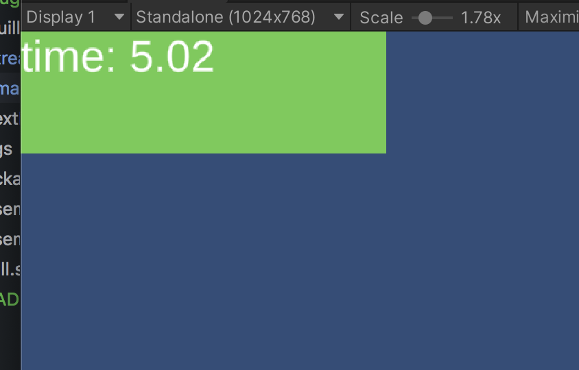

## quill

This project created to explore unity modding capabilities in mind. Idea is providing a scripting api to community to make user interfaces after game released(like wow, don't starve, etc.)
 
 Quill is just a small wrapper based on pure Text Mesh Pro. You can create UI using its c# api, programmatically.


```csharp
var label = Quill.CreateLabel("hello world");
label.SetSize(100, 30);
label.SetPosition(100, 100);
```

Also, it exposes c# api to lua (MoonSharp). It will hook up `Init` and `OnUpdate` functions from `main.lua` file. 

```csharp
private void Start()
{
    Quill.Init();
    QuillLua.Run();
}

private void Update()
{
    QuillLua.Update();
}
```

`StreamingAssets/LUA/main.lua`

```lua

local timePassed = 0
local timeLabel = nil

function Init()

    local root = quill.empty()

    color = {}
    color.r = 0.4
    color.g = 0.8
    color.b = 0.3

    local box = quill.box()
    box.setColor(color.r, color.g, color.b)
    box.setSize(300, 100)
    root.addChild(box)

    timeLabel = quill.label("time")
    timeLabel.setSize(300, 100)
    
    root.addChild(timeLabel)
end

function OnUpdate(dt)
    timePassed = timePassed + dt
    timeLabel.setText("time: " .. string.format("%.2f", timePassed))

end
```




## This project is far far away from complete, heavily WIP.


### dependencies
Text Mesh Pro

#### references
[Moonsharp](https://www.moonsharp.org)